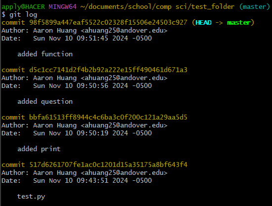
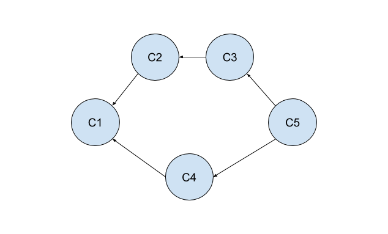

# How-to-Learn-Git

## Resources for those new to GitHub and Git with annotations from a relatively new Git/GitHub user

### How I would go about learning Git if I knew everything I know now at the beginning 
### (Resources That I Have Used, in the Order I Encountered Them)
One of the first things I encountered, perhaps by luck or through research, was that GitHub offers Pro for free to students. Thus, if you are a student like me, I would encourage you to verify your student identity to unlock free, powerful resources such as Copilot and much more. You can find all the offers in the GitHub Student Developer Pack in the link below. You can also sign up for the Student Pro Offer easily after clicking on that link.
* https://education.github.com/pack#github-copilot

The very first tutorial that I used from the GitHub Student Developer Pack was Introduction to GitHub. This tutorial was informative and easy to follow. It only takes about 15-20 minutes. However, this only covers how to do version control on Github, and not with Git. What I mean is this tutorial covers features on the GitHub site, and not remotely changing with Git.
* https://github.com/skills/introduction-to-github

The second tutorial that I did was how to create a GitHub Page. I thought that it would be interesting to do, but I ended up realizing that it was too hard to implement. I wouldn't recommend this tutorial but if you are interested in creating a blog/page of a repository, this is a basic guide to that. 
* https://github.com/skills/github-pages

I use VSCode Interpreter, and I wanted to learn how to use Git in VSCode. I first noticed that VSCode allows one to link their GitHub account with the local VSCode interpreter, allowing for an easy connection between code and GitHub, so I did that. I found out how to do this on my own, but if you need a guide I will put it in the first bullet point below. Afterwards, I download Git for Windows, to be able to exploit Git (link to Git in the second bullet below). Now, I was ready to learn how to use Git. The video that I found most helpful was under VSCode's YouTube channel, which was "Official Beginner's Guide to GitHub Using VSCode." It helped a lot with the basics of how to use Git source control with VSCode, but you need to practice and review the video a few times to fully understand everything about committing, branching, merging, and push/pulling. I have put that video below as well. I would recommend at of these steps (some are mandatory, like installing Git!).
* https://www.youtube.com/watch?v=uqZwcUTVew8
* https://git-scm.com/downloads
* https://www.youtube.com/watch?v=i_23KUAEtUM&t=254s&pp=ygUTZ2l0aHViIHdpdGggdnMgY29kZQ%3D%3D

On a whim, after some early commits and repository creations, I wanted to upgrade my profile landing page. I found this short video (in bullet below) that explains how to make some simple and cool visuals with little to no effort. I did something very basic and you can check out my profile (if you haven't already!) to see what I mean. If you like it, I would highly recommend it!
* https://www.youtube.com/watch?v=DWFs6aqknqw

For the first stretch goal that I was assigned in my class, I needed to explore the difference between functional code, and professionally-ready code. Through my research and actions, I had to implement Git/GitHub and do research on both. I noted my findings and actions in the document that I wrote below. I would recommend documenting things that you have learned and sharing them with others to get feedback on your understanding and improve your technical writing abilities.
* https://docs.google.com/document/d/1kISeX1kLAWPYo4WMF4C1HkhNQaWgN5VVfX4P5wZZieo/edit?usp=sharing

I would also encourage working with others on code as early as possible. What I mean is to join a group project and create a group repository so that you can implement your knowledge about branches, merging, and push/pulling. This way, you will have these concepts deeply reinforced. I haven't done this yet, but I did contribute to one of my classmate's repositories, and through that, I could practice branches, merging, and push/pulling on a small scale.

One of the most recent things that I have learned to do on GitHub is how to write a useful README file. These are arguably the most important files in a GitHub repository as they inform a prospective reader about what the repository is about, what is being worked on, what known issues there might be, and how one could contribute. For me, some of these additions to the README file are overkill, but I would say that learning about formatting, adding images, and simple things like how to bullet and space correctly is vital to creating a functional README file. Some resources that I found and would recommend are below:
* https://www.youtube.com/watch?v=E6NO0rgFub4
* https://stackoverflow.com/questions/14494747/how-to-add-images-to-readme-md-on-github
* https://docs.github.com/en/get-started/writing-on-github/getting-started-with-writing-and-formatting-on-github/basic-writing-and-formatting-syntax#paragraphs

As of now, the final piece of material that I have been looking at is how to use Git outside of the VSCode interpreter i.e. through the command prompt/Git Bash. The repository that I am using is created by my teacher Dr. Zufelt and I will share my notes below. The repository is very informative and I have been learning a lot so far.

Overall, I would characterize my experience with Git and GitHub as fulfilling and challenging. While I still have initial difficulties with version control, it is fun to learn about the ways that I can organize files and share and collaborate with others. I feel like I am starting to understand how to use Git and GitHub in meaningful manners.

### My Notes On a Follow-Through of Dr. Zufelt's Guide to Git
My teacher in CSC 471: Cryptography Dr. Zufelt has given me a bunch of videos, resources, and exercises to learn how to use Git. I have forked the repository that contains the material that I am following: https://github.com/aaron-h6665/resources_for_students.git. There is also info on Web Dev if you are interested but I will not be covering that.

1. The Command Line    
I am using Git Bash. Here are some basic commands that one can use in the command line.
   * cd - Change Directory
   * cd .. - Change to Parent Directory
   * code - Create File
   * cp - Copy
   * rm - Remove
   * mkdir - Make Directory
   * mv - Move File
   * ls - List Files/Folders in Working Directory
   * pwd - Print Working Directory

2. Commits    
Consider the normal saving capabilities of a file. If you want to return to a previous version, you may be unable to do that as you have overwritten the file. However, Git commits get around this (like a snapshot in time).
   * git init - Initialize a Folder as a Git Repository
   * git add - Turn Untracked Files to Tracked (Changes can be Committed)
   * git commit -m - Commit Changes
   * git checkout - the basic mechanism for moving around in the commit tree, moving your focus (HEAD) to the specified commit.
   * git log - A Log of Commits (Author, Date, Name of Commit)

3. Vim    
When you type git commit without the "-m" you will enter the code editor of Vim which is built into the command prompt. Vim is high-powered but very complex.
We don't need to use it for now. To escape, and make a commit, type ":wq" (write quit).

4. Exercise: "Now that you've seen the basics of the command line and git, I want you to make a repository that has exactly 4 commits in it."    
I approached this problem by changing directories (cd) until I reached a desired directory and then making a new one using mkdir. Then, I used "git init" to initialize the new directory as a Git Repository. Next, I created a new Python file called test using "code test.py." This should open a new file in your interpreter. In my case, my Visual Studio Code opened up to a blank file called "test.py." Then make a basic edit to the file. I just added something simple like "10+10." Right now the file is untracked, so we should make the file tracked (changes can be committed) by using "git add." Now we can make our first commit by using "git commit -m". First commit done. To reach four commits, we would just make three more edits and commit each time (remember to use "git add" each time). That's how we can reach exactly 4 commits to the repository. You can check how many commits using "git log."

5. Git: Branches, Merges, and Checking Out    
Branches and Merges are important features of Git. They allow us to work on two separate portions of a project at the same time and ultimately merge them together. Checkout allows us to switch our HEAD between branches.
   * git checkout -b feature - "-b" stands for making a branch. Switches to the "feature" branch.
   * HEAD -> feature
   * Important that you branch two branches together, there is a "giver" and a "receiver."
   * git merge - Merge two branches together
   * git checkout - the basic mechanism for moving around in the commit tree, moving your focus (HEAD) to the specified commit.

6. Exercise -- Now, I'd like for you to make a particular git tree. (Meaning: make a git repository, and create commits such that the commit tree looks like as below.) 

* How can you prove that this correct? _(Hint: it requires multiple uses of `git log`.)_

I will again explain my approach. First, we need to have an initial commit. Then we create a new branch "feature" using "git checkout -b feature." This will also switch to the "feature" branch. Now, we switch back to the "master" branch using "git checkout master." We add our second and third commits. Then we switch our "HEAD" to feature. Notice that the feature branch does not have the second or third commits.

Now, we should make our fourth commit. Switch once again back to master. Notice that the master branch does not have the fourth commit.

Now we use "git merge feature" to merge feature with branch and this will effectively be our fifth commit, thus completing the diagram and task above. Notice where the "HEAD" points.

